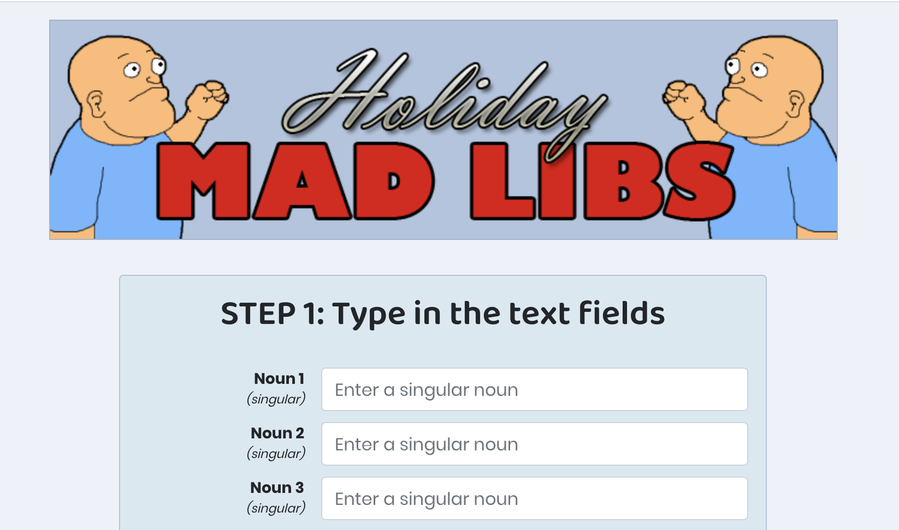
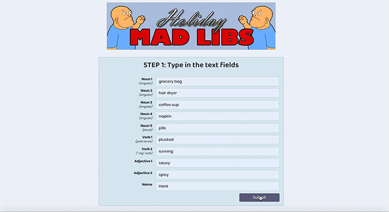

# Holiday Mad Libs

This project is a React-based app where users can enter in words and then choose a holiday-based story with their words implemented.

## Scripting

The app incorporates the use of React hooks to store the user's input values, the user's choice of story, and set which components should be rendered (steps 1, 2, and the rendered story) based on the user's interaction.

## Styling

The app is styled using built-in Bootstrap classes and a custom-written Sass stylesheet.

Mouse hover animations on buttons are handled using CSS3 transitions. The animations on the rendering of different container components are assisted by React Transition Groups.
